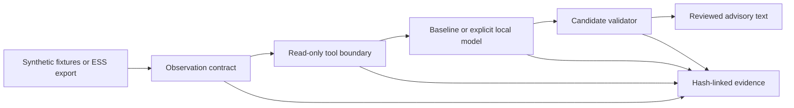

# Architecture and boundary contract

Design recorded 2026-09-20. This document describes project decisions; it does not claim conformance to an industrial safety standard.

There is no effect executor. The browser can request an assessment and export its evidence. These operations write local research records, never process tags. Only the operator-run export script executes trusted simulator code. Its synthetic setup and bad-quality scenario are fixture generation, not agent tools.

## Trust boundaries

1. The input is untrusted. JSON size, keys, values, identifiers, timestamps, required tags, units, quality, and alarm coverage are checked before inference. Input objects are detached before use. Only the two supported synthetic profiles are accepted.
2. The provider is untrusted. It returns tool requests or candidate IDs in structured JSON. Unknown tools are denied and recorded. A correct candidate without the required evidence reads is rejected.
3. The project policy is trusted, versioned code. `knowledge.py` defines the demo condition and permitted findings/checks. The validator requires all applicable findings and exact evidence references, so the provider cannot hide a known demo condition or invent a conclusion.
4. The output renderer is trusted code. It emits catalog text and observed evidence. It never treats model prose or alarm text as an instruction. The dashboard uses `textContent` for observations and outputs.
5. The evidence store is trusted local infrastructure. An outcome is released only after its record is committed. Chain verification detects edits relative to the stored chain; a separate anchor is needed for history replacement or truncation.
6. The local model daemon is trusted infrastructure. The client restricts the address, model metadata, request size, response size, and retries. It cannot enforce daemon isolation or attest actual inference weights. Host permissions and egress remain outside the agent boundary.

There is no protection against a malicious process with the same OS account editing the source, policy, or database. The browser session token and Host/Origin checks block ordinary cross-origin drive-by requests; they are not authentication against local processes. The standard-library HTTP server is for the local lab, not an internet deployment.

## Observation contract

The source of truth is `moa/contracts.py`; `python3 -m moa fixture` emits a complete example.

| Field | Meaning |
|---|---|
| `schema_version` | Exactly `1.0` |
| `snapshot_id` | Bounded identifier supplied by the adapter |
| `captured_at` | UTC wall-clock capture time, ending in `Z` |
| `profile` | `demo-cooling-v1` or `ess-u1-v1` |
| `source` | Synthetic declaration, adapter ID, revision, model ID |
| `tags` | ID, finite value, engineering unit, quality, UTC observation time |
| `alarms` | Reported records with ID, tag/equipment ID, condition, priority, state |
| `alarm_coverage` | `complete` is required; partial coverage is withheld |

The demo requires `TT101` in `degC` and `FT102` in `L/min`. The ESS U1 profile requires `TIC201` and `TIC202` in `DEG C`, plus `FIC102` in `M3/H`. Other exported ESS points remain observation data. All included tags must be good quality in this first version; this is conservative and may withhold advice because of an unrelated bad point. Scope-aware partial reasoning is future work.

Lab freshness is a project-selected 60 seconds, checked before reads and after generation. Allowed future clock skew is two seconds. Tag times must not follow capture and must fall within five seconds before it. These are lab constraints, not plant response-time requirements.

An accepted observation is not proof that a process is safe. Complete alarm coverage is an adapter declaration. Synthetic provenance is recorded but unauthenticated. A valid file can be assessed again while fresh; no monotonic source sequence, authenticated gateway identity, or replay prevention is claimed. Those are requirements for any future live adapter.

## Agent and provider behavior

`Agent.assess()` records the input and system prompt, validates the snapshot, prepares an explicit provider, then runs at most six turns. Tool reads and denials are recorded. The model can also abstain voluntarily. Input guard refusal, denied authority, invalid candidate, and voluntary abstention have distinct reason codes.

The baseline reads the snapshot and policy and selects the applicable catalog entries. Ollama must do the same using constrained JSON. Because the approved findings are deliberately narrow, v0.1 chiefly measures protocol and grounding behavior. It cannot demonstrate superior process reasoning or replace an operator. Future expansion requires new, reviewed knowledge and independent expected outcomes.

The optional provider checks `/api/tags` and `/api/show` before `/api/chat`. It records the model digest reported during preparation, not an attestation that weights could not change later. It has no `/api/pull` path. Responses must complete within bounded size and freshness; there is no automatic retry or alternate model. The client uses socket timeouts, not a hard whole-process inference deadline.

## Relationship to peb and Ignition

This repository defines a separate advisory boundary. It does not import peb internals, open peb operator state, or route plant effects through peb. A future peb integration must use an agreed, versioned interface and preserve the difference between a declaration, a permission, and an effect.

Ignition is not installed or connected here. Its future adapter must be independently shown to have read-only credentials and a read-only server surface, with no tag write, configuration write, script execution, or general query escape. An MCP tool's name or a write-disable flag alone is insufficient evidence of that boundary.
